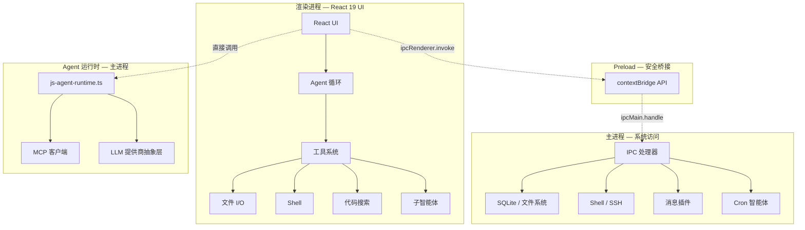

<p align="center">
  <a href="https://github.com/AIDotNet/OpenCowork">
    
  </a>
  <h1 align="center">OpenCowork</h1>
  <p align="center">
    <strong>开源桌面多智能体 AI 协作平台</strong><br>
    为 AI 智能体赋予本地工具、并行团队协作及无缝办公集成能力。
  </p>
</p>

<p align="center">
  
  <br>
</p>

<p align="center">
  <a href="README.md">English</a> •
  <a href="#为什么选择-opencowork">为什么选择 OpenCowork</a> •
  <a href="#核心特性">核心特性</a> •
  <a href="#架构">架构</a> •
  <a href="#快速开始">快速开始</a>
</p>

<p align="center">
  
  
  
  
  
</p>

---

## 🚀 为什么选择 OpenCowork？

传统的 LLM 界面往往是"环境孤岛"。开发者通常需要花费 50% 的时间在聊天窗口和 IDE 之间手动复制粘贴代码、终端日志和文件内容。

**OpenCowork 通过以下方式解决这一问题：**

- **本地代理能力** — 智能体可以在您的许可下直接读写文件并执行 Shell 命令。
- **上下文感知** — 无需再手动喂数据。智能体会自主探索您的代码库和日志。
- **任务编排** — 复杂任务（如"重构此模块并更新测试"）会被拆解并由专门的子智能体处理。
- **人在回路** — 通过透明的工具调用审批系统，您始终拥有最终控制权。

## 💡 灵感来源

OpenCowork 的灵感深受 **Claude CoWork** 的启发。我们相信，生产力的未来在于"协作（Co-Working）"关系——由人类提供方向，AI 负责迭代执行、工具操作以及跨平台沟通。

## ✨ 核心特性

### ⚙️ 核心运行时

- **4 层 Electron 架构** — 主进程、Preload 安全桥接、渲染进程 UI、以及运行在主进程中的 Agent 运行时。
- **提供商无关** — 支持任何 LLM 提供商，您可自由选择模型。
- **全栈 TypeScript** — 从数据库到 UI 端到端的类型安全。

### 🔄 5 种会话模式

每次对话可根据任务选择最合适的模式：

| 模式      | 用途                                                     |
| --------- | -------------------------------------------------------- |
| `chat`    | 纯对话问答，无工具调用                                   |
| `clarify` | 在执行前提问以澄清模糊需求                               |
| `cowork`  | 完整 Agent 模式：代码搜索、文件 I/O、Shell、子智能体委派 |
| `code`    | 聚焦代码生成与编辑，集成 Monaco Editor                   |
| `acp`     | 自动化编码管道：自主规划、实现、审查                     |

### 🧰 原生工具箱与丰富技能

- **内置工具** — 文件 I/O、Shell（bash/powershell）、代码搜索（glob/grep）、网页抓取、OCR、Excel/Word/PDF 处理。
- **可扩展技能** — 通过 Markdown 定义的技能加载领域特定能力：
  - **1RPA** — 供应商发票上传（支持新时达、上海电气、比亚迪等 SRM 系统）。
  - **CSV 管道** — 过滤、合并、聚合、转换表格数据。
  - **文档套件** — 创建与编辑 DOCX、XLSX、PDF，支持修订标记和格式化。
  - **网页抓取** — 从实时页面提取结构化内容。
  - **图片 OCR** — 从截图和扫描文档中识别文字。
  - **邮件起草** — 基于模板撰写专业商务邮件。
  - **微信 UI 发送** — 通过桌面微信自动化发送消息。

### 💬 8 大办公通讯平台集成

将本地智能体连接到任意通讯平台：

| 平台                 | 支持 |
| -------------------- | ---- |
| 飞书 (Feishu / Lark) | ✅   |
| 钉钉 (DingTalk)      | ✅   |
| Discord              | ✅   |
| QQ                   | ✅   |
| Telegram             | ✅   |
| 企业微信 (WeCom)     | ✅   |
| 微信公众号 (Weixin)  | ✅   |
| WhatsApp             | ✅   |

### ⏰ 持久化与 Cron 智能体

- **SQLite 持久化** — 消息、会话、项目、任务和计划重启不丢失。
- **Cron 调度** — 为日报、日志监控或任何周期性任务调度智能体。
- **多渠道交付** — 结果可通过桌面通知或任意通讯插件送达。

## 🛠️ 快速开始

### 环境要求

- Node.js >= 18
- npm >= 9

```bash
git clone https://github.com/AIDotNet/OpenCowork.git
cd OpenCowork
npm install
npm run dev
```

### 常用命令

| 命令                | 说明                                     |
| ------------------- | ---------------------------------------- |
| `npm run dev`       | 启动 Electron + Vite 热重载开发          |
| `npm run build`     | 类型检查并构建生产版本                   |
| `npm run build:win` | 构建 Windows 安装包                      |
| `npm run lint`      | ESLint 检查（带缓存）                    |
| `npm run typecheck` | TypeScript 类型检查（主进程 + 渲染进程） |
| `npm run format`    | Prettier 自动格式化                      |

> **数据目录：** `~/.open-cowork/` — 包含 SQLite 数据库（`data.db`）、配置文件、智能体、命令和提示词。

## 🏗️ 架构

OpenCowork 采用 **4 层 Electron 架构**，兼顾安全与性能。



- **渲染进程** — React 19 UI、Agent 循环和工具系统。
- **Preload** — 安全的 `contextBridge`，提供精简的 API 接口。
- **主进程** — IPC 处理器、SQLite、文件系统、Shell、SSH、插件。
- **Agent 运行时** — 提供商无关的运行时（`js-agent-runtime.ts`），支持 MCP 客户端。

## 🌟 使用场景

- **自主编程** — 让智能体直接在您的工作区重构代码、修复 Bug 并编写测试。
- **自动化运维** — 调度智能体监控日志或系统状态，并汇报至飞书/钉钉/Slack。
- **数据调研** — 智能体可以抓取网页数据、处理本地 CSV 并生成可视化报告。

## 📈 Star 历史

[](https://star-history.com/#AIDotNet/OpenCowork&Date)

## 🤝 参与贡献

我们欢迎任何形式的贡献！请参阅我们的 [开发指南](docs/development.md) 了解更多细节。

#### 特别感谢

<div>
<div align="left">
<h1>RoutinAI</h1>

</div>
</div>
[RoutinAI](https://routin.ai/) 是一款企业级统一的大语言模型（LLM）API 网关，它提供了一个单一、类型安全的接口，可访问来自 GPT、Claude 和 Gemini 系列的 100 多种领先的大语言模型，包括 gpt-5.4、claude-opus-4-6 和 gemini-3.1-pro-preview 等模型。它通过提供零延迟边缘路由、无需代码修改即可无缝切换模型、统一计费以及具有支出上限和访问策略的集中式治理，消除了管理多个 AI 供应商的复杂性。

## 💝 赞助商

- [lchlfe@hotmail.com](mailto:lchlfe@hotmail.com)
- [caomaohanfengZT](https://github.com/caomaohanfengZT)
- [struggle3](https://github.com/struggle3)

## 📜 许可证

本项目采用 [Apache License 2.0](LICENSE) 开源协议。

---

<div align="center">

如果这个项目对您有帮助，请点亮一颗 Star ⭐

由 **AIDotNet** 团队倾情打造 ❤️

</div>
